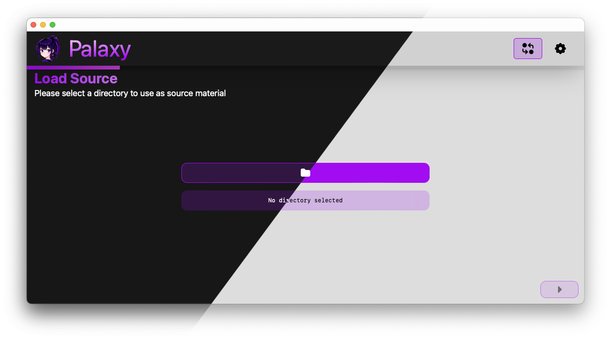
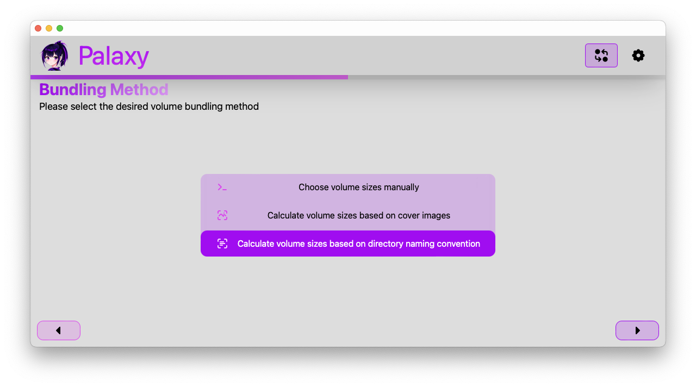
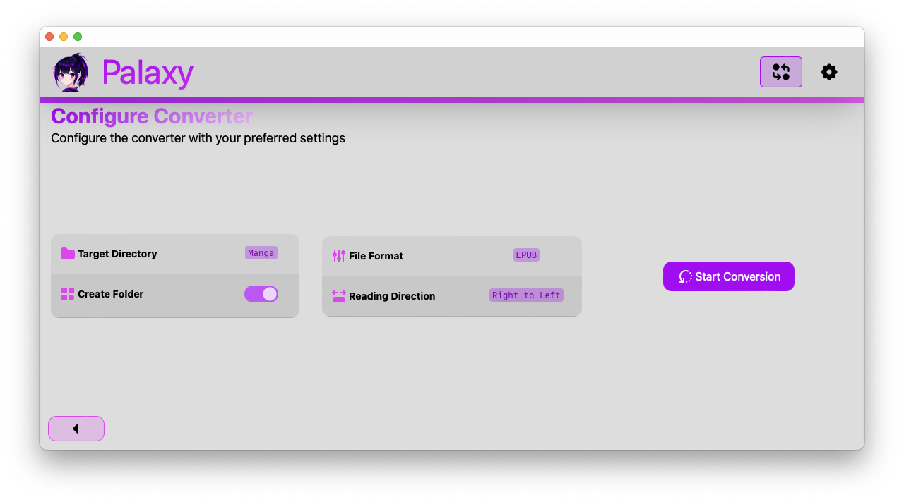
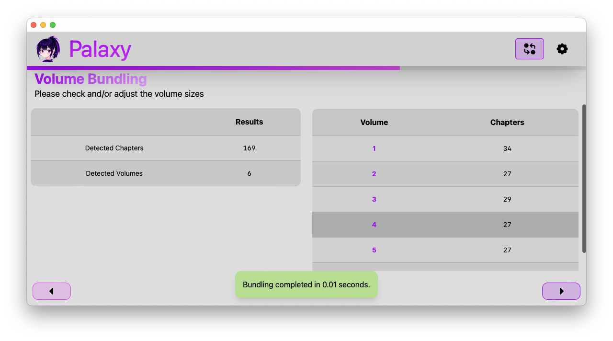

# Installation

You can install Palaxy by going to the [releases page]() and downloading the latest version for your
operating system. Please keep in mind that Palaxy is still in development and may have bugs. An
automatic updater is planned for the future but is not available at the moment, you therefore have
to manually check for updates on the release page.

# Features

## Light and Dark Mode

Palaxy comes with a light and dark mode (as well as system default), which you can switch between using the settings
menu.

## Different bundle options

Palaxy offers different bundle options for your manga. You can manually allocate the pages to a volume or let Palaxy
handle it for you by either using the cover pages for differentiating volumes or by using the page count.

## Customizable output

Palaxy allows you to customize the output to your liking. You can change the file format, the reading direction,
folder creation, and more to come in the future.

## Blazingly fast

Palaxy is built with speed in mind.
It uses [Tauri](https://v2.tauri.app) as backend to leverage the power of Rust and asynchronous programming.
The frontend is built with [SvelteKit](https://kit.svelte.dev) and [TailwindCSS](https://tailwindcss.com) to provide a
fast, smooth and responsive user interface that is pleasant to use.

# Development

This project is still in development and is not yet ready for everyday use. If you want to contribute, feel free to
fork the repository and create a pull request. You can also open an issue if you find a bug or have a feature request.
