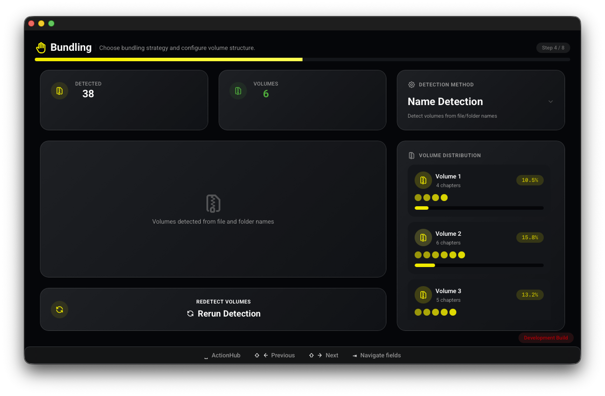
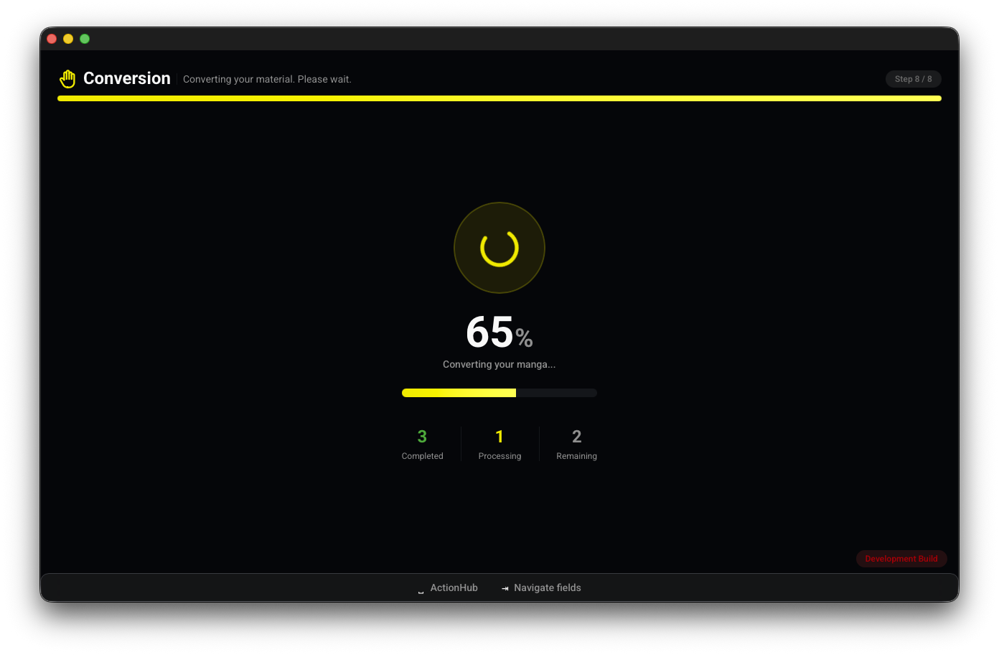
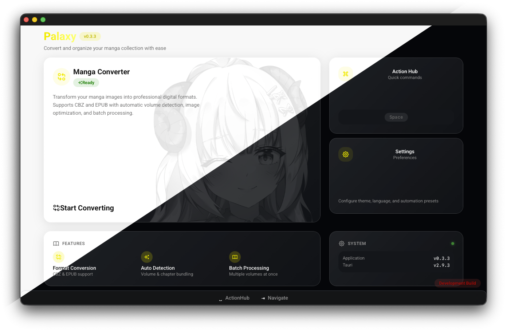
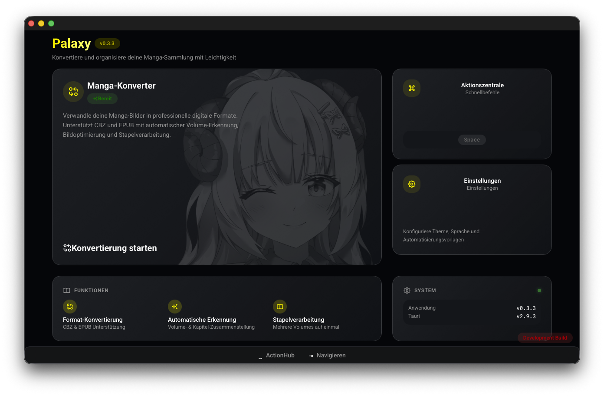

<div align="center">

# Palaxy

**A blazingly fast manga converter for Windows, Linux and MacOS**

Convert your manga directories into CBZ or EPUB formats with intelligent auto-detection and parallel processing.

[](LICENSE)
[](https://github.com/LuMiSxh/Palaxy/releases)

[Features](#features) • [Installation](#installation) • [Quick Start](#quick-start) • [Development](#development)

</div>

> [!WARNING]
> **Deprecation Notice (As of May 23, 2026)**
> Palaxy is no longer actively maintained. Please use its successor, **[Thasia](https://github.com/LuMiSxh/Thasia)**, which is now the recommended tool for this workflow.

---

## Features

### Intelligent Auto-Detection



Palaxy automatically analyzes your manga directories and provides smart recommendations:

- **Pattern Recognition**: Detects volume and chapter structure using `VOL-CH/NUM.ext` format (e.g., `001-023/01.png` = Volume 1, Chapter 23, Page 1)
- **Cover Detection**: Identifies cover pages using grayscale analysis
- **Format Validation**: Ensures all images are properly formatted
- **Smart Bundling**: Recommends optimal bundling strategies (by-chapter, by-volume, or all-in-one)

### Multiple Output Formats

**CBZ (Comic Book Archive)**

- Optimized ZIP compression with stored mode for already-compressed images
- Perfect for comic readers and media servers (Komga, Kavita)
- Most common use case (90% of conversions)

**EPUB**

- Standards-compliant EPUB 3.0
- Ideal for e-readers (Kindle, Kobo, etc.)
- Full metadata support

### Image Encoding Options

**Original** (Recommended)

- No re-encoding, preserves original quality
- Fastest conversion speed
- Best when source images are already optimized

**AVIF**

- Modern format with superior compression (up to 4x smaller files)
- Auto-tuning based on image size and characteristics
- Grayscale detection for optimal settings
- Significantly slower processing

**WebP**

- Good compression with reasonable speed
- Wide compatibility across devices
- Balanced option for e-readers

### Customization

- **Metadata Editor**: Add title, author, publisher, and description
- **Output Directory**: Choose where to save converted files
- **Bundle Strategies**: Flexible grouping options (by-chapter, by-volume, all-in-one)
- **Volume Boundaries**: Manually adjust auto-detected volumes if needed

### User Interface

**Live Progress Tracking**



Real-time conversion monitoring with:

- Large percentage display and animated spinner
- Visual progress bar
- Live statistics: Completed, Processing, and Remaining volumes
- Smooth animations and transitions

**Theme Support**



Choose between light mode, dark mode, or system default with seamless switching.

**Internationalization**



Currently available in English and German, with more languages coming soon.

**Additional Features**

- **Wizard-based workflow**: 8-step guided process from import to export
- **Drag & drop**: Easy file import
- **Keyboard shortcuts**: Full keyboard navigation support

---

## Installation

Visit the [releases page](https://github.com/LuMiSxh/Palaxy/releases) and download the latest version for your operating system:

- **Windows**: `Palaxy_x.x.x_x64_en-US.msi` or `Palaxy_x.x.x_x64-setup.exe`
- **macOS Intel**: `Palaxy_x.x.x_x64.dmg`
- **macOS Apple Silicon**: `Palaxy_x.x.x_aarch64.dmg`
- **Linux**: `Palaxy_x.x.x_amd64.AppImage`, `.deb`, or `.rpm`

### System Requirements

- **OS**: Windows 10+, macOS 11+, or modern Linux distribution
- **RAM**: 512MB minimum, 2GB recommended for large conversions
- **Disk**: Temporary space equal to largest volume size

**Note**: An automatic updater is planned but not yet available. Check the releases page for updates.

---

## Quick Start

### HakuNeko Workflow

Palaxy is optimized for manga downloaded with HakuNeko:

**Step 1: Download manga using HakuNeko**

Typical directory structure after download:

```
MangaTitle/
├── 001-001/
│   ├── 01.png
│   ├── 02.png
│   └── ...
├── 001-002/
│   ├── 01.png
│   └── ...
├── 002-024/
│   └── ...
```

Format: `VOL-CH/NUM.ext` where:

- `001-001` = Volume 1, Chapter 1
- `002-024` = Volume 2, Chapter 24
- `01.png` = Page 1

**Step 2: Import into Palaxy**

- Launch Palaxy
- Drag and drop the manga folder
- Automatic scanning begins (parallel directory scan, max 64 concurrent)

**Step 3: Review auto-detection**

- Check detected volumes and chapters
- Adjust volume boundaries if needed
- Verify suggested bundle strategy

**Step 4: Configure output**

- Choose format: CBZ or EPUB
- Select encoding: Original, AVIF, or WebP
- Set output directory
- Edit metadata (optional)

**Step 5: Convert**

- Start conversion
- Monitor live progress with detailed statistics
- Find converted files in output directory

### Common Use Cases

| Scenario          | Format | Encoding      | Notes                                 |
| ----------------- | ------ | ------------- | ------------------------------------- |
| Comic reader apps | CBZ    | Original      | Fastest, preserves quality            |
| Media servers     | CBZ    | Original      | Standard workflow                     |
| E-readers         | EPUB   | Original/WebP | Best compatibility                    |
| Archival/Storage  | CBZ    | AVIF          | Smallest file size (up to 4x smaller) |

---

## Development

### Prerequisites

- [Node.js](https://nodejs.org/) 22+
- [pnpm](https://pnpm.io/) (required)
- [Rust](https://www.rust-lang.org/) 1.70+
- [Tauri Prerequisites](https://v2.tauri.app/start/prerequisites/) for your OS

### Setup

```bash
# Clone the repository
git clone https://github.com/LuMiSxh/Palaxy.git
cd Palaxy

# Install dependencies
pnpm install

# Run in development mode
pnpm run tauri dev

# Build for production
pnpm run tauri build
```

### Contributing

Contributions, bug reports, and feature requests are welcome! Feel free to [open an issue](https://github.com/LuMiSxh/Palaxy/issues) or submit a pull request.

---

## License

This project is licensed under the MIT License - see the [LICENSE](LICENSE) file for details.

---

## Acknowledgments

- Built with [Tauri](https://tauri.app)
- Optimized for the [HakuNeko](https://hakuneko.download/) workflow
- Inspired by the manga community

---

<div align="center">

**Made with passion by LuMiSxh**

[GitHub](https://github.com/LuMiSxh/Palaxy) • [Issues](https://github.com/LuMiSxh/Palaxy/issues) • [Releases](https://github.com/LuMiSxh/Palaxy/releases)

</div>
